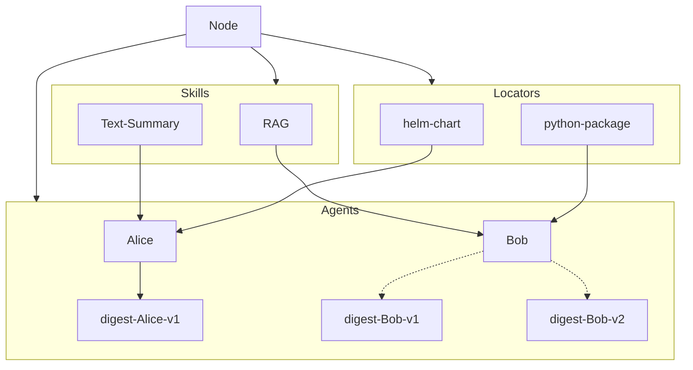

# Architecture

This document defines the Directory protocol, including the data models, services, and interfaces.
It serves as a technical document on the specification and implementation of the protocol.

<!-- TOC -->

- [Architecture](#architecture)
  - [Data Models](#data-models)
    - [Structure](#structure)
    - [Schema](#schema)
  - [Storage](#storage)
    - [Content digest](#content-digest)
  - [Network](#network)
  - [Routing](#routing)
    - [Announcement](#announcement)
    - [Discovery](#discovery)
    - [Routing Tables](#routing-tables)
    - [Naming \& Namespacing](#naming--namespacing)
  - [Stack](#stack)
  - [Datastore API](#datastore-api)
  - [Considerations](#considerations)
    - [FS implementation](#fs-implementation)
    - [Replication](#replication)
    - [Availability](#availability)
    - [Security](#security)
    - [Performances](#performances)

<!-- TOC -->

---

## Data Models

### Structure

Implementations MUST use a **self-verifying data structure** to represent the objects stored and distributed across the system.
This ensures the objects that the Directory deals with to have the following properties:

- **authenticated** -- objects can be hashed and verified against the link
- **permanent** -- once fetched, objects can be cached forever
- **universal** -- any data structure can be represented as a Merkle-DAG
- **decentralized** -- objects can be created by anyone, without centralized writers

In turn, these yield properties for the system as a whole:

- links are content addressed
- objects can be served by untrusted agents
- objects can be cached permanently
- objects can be created and used offline
- networks can be partitioned and merged
- any data structure can be modelled and distributed

The current implementation of the Directory uses Merkle-DAGs and Merkle-CRDTs as the underlying data structures.
See more in the [Merkle-DAGs/CRDTs](https://research.protocol.ai/publications/merkle-crdts-merkle-dags-meet-crdts/psaras2020.pdf) research papers.

### Schema

Data models MUST conform to the **Agent Data Model schema** defined in the [Open Agent Schema Framework](https://schema.oasf.agntcy.org/).
The data models currently used across the system are defined in [api/core](api/core/v1alpha1).

## Storage

Implementations MUST expose a **content-addressable storage interface** that allows:

- **publication** -- objects can be pushed and stored permanently
- **retrieval** -- objects can be accessed and pulled using only the content digest
- **lookup** -- associated metadata can be accessed without pulling in the whole object
- **verification** -- objects can be verified against the content digest
- **removal** -- objects can be removed from the storage

Nodes participating in the network MAY have control on who can access this interface,
either the whole network, a subset of other nodes based on some policies, or no one.
It is the responsibility of the storage layer to serve these operations
efficiently by taking into account the requirements such as data availability, replication, etc.

The storage system can be satisfied with various kinds of implementations.
The current implementation of the Directory uses an OCI Registry for storage.
See more in the [OCI Distribution](https://github.com/opencontainers/distribution-spec) specs.
The interface currently used across the system is defined in [api/store](api/store).

### Content digest

The content digest MUST be generated using a [cryptographic hash function](https://en.wikipedia.org/wiki/Cryptographic_hash_function).
The purpose of the digest is to serve as a __global identifier of arbitrary data__ on the storage layer.
See more in the [OCI Content Digest](https://github.com/opencontainers/image-spec/blob/main/descriptor.md#digests) specs.

## Network

The Directory network MUST use a cryptographically strong identity.
A "dir node" is a program that can publish, find, and replicate objects across the network.
Its identity is defined by a private key.

The node MAY be allowed to work in one of the following **modes of operation**:

- **client** -- The node can interact with the public network, but it does not expose any interfaces to it.
   The interfaces can be exposed only to the local network.
- **swarm** -- The node exposes all its interfaces to a subset of nodes on the network.
- **server** -- The node exposes all its interfaces to the public network.

All interfaces and operations on the network MUST be provided and performed by the node itself.

## Routing

Implementations MUST expose a **routing interface** that allows the **announcement and discovery** of agent records across the network.
The routing layer serves two important purposes:

- peer routing -- to find and connect with other nodes on the network
- content routing -- to find the data published across the network

The routing system can be satisfied with various kinds of implementations.
The current implementation of the Directory uses DHT (distributed hash table) for routing.
See more in the [libp2p](https://github.com/libp2p/specs) specs.
The interface currently used across the system is defined in [api/routing](api/routing).

### Announcement

The nodes participating in the network MUST be able to **publish and respond** to requests across the network to be able to update their routing tables.
Nodes MAY also optionally pull the data from the node that sent the event.

The minimal interface required to implement the Announcement API consists of a method that broadcasts locally available Agent data models to the rest of the network.
For example, `Publish(routing.PublishRequest)`.

### Discovery

The nodes participating in the network MUST be able to **list and query** published contents using attribute-based key matching via:

- **name** -- List agents by name
- **skill** -- List agents by skills names
- **locator** -- List agents by locator types
- **extensions** -- List agents by extension types

Implementations MUST expose at least skill-based discovery,
but MAY expose more additional discovery types and more granular querying logic.
The minimal interface required to implement the Discovery API consists of a method that queries the routing table based on a given request.
For example, `List(routing.ListRequest)`.

### Routing Tables



### Naming & Namespacing

All objects and their properties in the system MUST be identifable using path-based naming schema.
The current implementation of the Directory uses IPLD schema.
See more in the [IPLD](https://ipld.io) specs.

## Stack

## Datastore API

This component defines the minimal internal interface needed to fully serve previously defined APIs.
It can be supported with any path-based key-value store.
Its main usage is to provide local data caching, querying, and data synchronisation to remote services.

The current implementation of the Directory relies on the [go-datastore](https://github.com/ipfs/go-datastore).
This choice is twofold: a) we can build all our APIs by relying solely on the single go-datastore interface, and b) we can fully reuse the datastore for DHT serving.

## Considerations

### FS implementation

This shows how the Directory Protocol can be implemented using filesystem-only representation.

NOTE: This is highly experimental and may not be up to date.

```bash

/<dir>                - network level
  /<node>             - node level
    /blobs            - pushed objects
      /<digest-X>
      /<digest-Y>
    /<agent>          - collection/repo level
      version         - repo info file
      /tags           - published objects (resolves to a digest)
        /<tag-A>
        /<tag-B>
      /skills         - list of skills, ie. digests by skill
        /<skill>
          /<digest-X>
      /locators       - list of locators, ie. digests by locator
        /<locator>
          /<digest-Y>
      /extensions     - list of extensions, ie. digests by extension
        /<extension>
          /<digest-X>
```

### Replication

### Availability

### Security

### Performances

---

List of items to be done:

- Add RFC template
- Add some estimates for network and data size
- Provide system requirements
- DHT considerations
