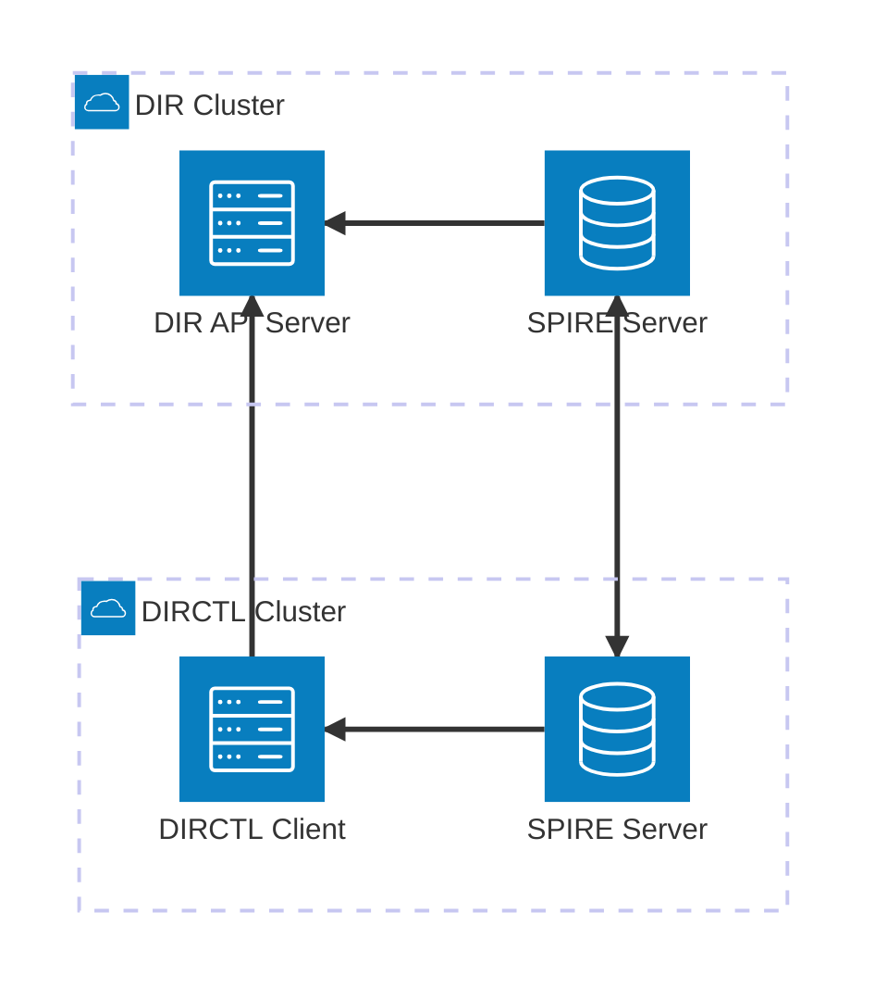

# SPIRE Federation Setup and Configuration

This document provides comprehensive guidance for setting up and configuring SPIRE (SPIFFE Runtime Environment) federation between Directory (DIR) and Directory (DIRCTL) services within the Agent Directory ecosystem.

## Overview

The Agent Directory uses SPIRE federation to establish secure, identity-based communication between distributed components. This setup creates two separate SPIRE trust domains that can federate with each other, enabling secure cross-domain service communication.

### Architecture

The federation setup consists of:

- **DIR Trust Domain** (`dir.example`): Hosts the main Directory server
- **DIRCTL Trust Domain** (`dirctl.example`): Hosts the Directory control client
- **Cross-domain Federation**: Enables secure communication between the two trust domains



## Components

### SPIRE Infrastructure

- **SPIRE Server**: Identity provider and certificate authority for each trust domain
- **SPIRE Agent**: Workload attestation and SVID provisioning
- **Federation Bundle Endpoint**: Secure bundle exchange between trust domains

### Directory Services

- **DIR API Server**: Directory service with OCI-backed storage
- **DIRCTL Client**: Directory control client for management operations

## Configuration

### SPIRE Server

Each SPIRE server is configured with:

- **Federation enabled**: Allows cross-domain trust establishment
- **LoadBalancer service**: Exposes bundle endpoints externally. Can be switched to any other example.
- **Controller Manager**: Manages SPIFFE workload entries

#### Deployment

The SPIRE deployment includes:

- **SPIRE CRDs**: Custom resource definitions for SPIRE components
- **SPIRE Server**: With federation enabled and bundle endpoint publically exposed
- **Trust Domain Configuration**: Sets the specific trust domain name

Key configuration parameters:
- `global.spire.trustDomain`: Sets the trust domain identifier
- `spire-server.service.type`: Exposes bundle endpoint via LoadBalancer
- `spire-server.federation.enabled`: Enables federation capabilities
- `spire-server.controllerManager.watchClassless: true`: Manages all SPIRE workloads

Minimal example deployment can be performed via:

```bash
export TRUST_DOMAIN="my-service.local"
export SERVICE_TYPE="LoadBalancer"

helm repo add spiffe https://spiffe.github.io/helm-charts-hardened

helm upgrade spire-crds spire-crds \
    --repo https://spiffe.github.io/helm-charts-hardened/ \
    --create-namespace -n spire-crds \
    --install \
    --wait \
    --wait-for-jobs \
    --timeout "15m"

helm upgrade spire spire \
    --repo https://spiffe.github.io/helm-charts-hardened/ \
    --set global.spire.trustDomain="$TRUST_DOMAIN" \
    --set spire-server.service.type="$SERVICE_TYPE" \
    --set spire-server.federation.enabled="true" \
    --set spire-server.controllerManager.watchClassless="true" \
    --namespace spire \
    --create-namespace \
    --install \
    --wait \
    --wait-for-jobs \
    --timeout "15m"
```

#### Bundle Exchange

SPIRE bundles are extracted and shared between trust domains:

```bash
kubectl get configmap -n spire spire-bundle -o 'go-template={{index .data "bundle.spiffe"}}'
```

### Agent Directory

Each Agent Directory deployment is configured with federation details:

#### DIR Server Federation

```yaml
apiserver:
  service:
    type: LoadBalancer

  spire:
    enabled: true
    trustDomain: dir.example
    federation:
      - trustDomain: dirctl.example
        bundleEndpointURL: https://${DIRCTL_BUNDLE_ADDRESS}
        bundleEndpointProfile:
          type: https_spiffe
          endpointSPIFFEID: spiffe://dirctl.example/spire/server
        trustDomainBundle: |
          ${DIRCTL_BUNDLE_CONTENT}
```

#### DIRCTL Client Federation

```yaml
env:
  - name: DIRECTORY_CLIENT_SERVER_ADDRESS
    value: ${DIR_API_ADDRESS}

spire:
  enabled: true
  trustDomain: dirctl.example
  federation:
    - trustDomain: dir.example
      bundleEndpointURL: https://${DIR_SPIRE_BUNDLE_ADDRESS}
      bundleEndpointProfile:
        type: https_spiffe
        endpointSPIFFEID: spiffe://dir.example/spire/server
      trustDomainBundle: |
        ${DIR_SPIRE_BUNDLE_CONTENT}
```

## Example

An example deployment that sets up two k8s Kind clusters and deploys the necessary infrastructure described above is provided via the Taskfile command:

```bash
## Deploy
sudo task test:spire

## Cleanup
task test:spire:cleanup
```

NOTE: The example deployment uses [cloud-provider-kind](https://github.com/kubernetes-sigs/cloud-provider-kind) to expose services from Kind clusters for cross-cluster communication between SPIRE Bundle APIs and DIR API. It requires sudo privileges to update docker network configuration for the clusters via host rules.

## References

- [SPIRE Documentation](https://spiffe.io/docs/latest/spiffe-about/overview/)
- [SPIRE Federation Guide](https://spiffe.io/docs/latest/spire-helm-charts-hardened-advanced/federation/)
- [SPIRE Helm Charts](https://github.com/spiffe/helm-charts-hardened)
- [SPIRE Controller Manager](https://github.com/spiffe/spire-controller-manager)
