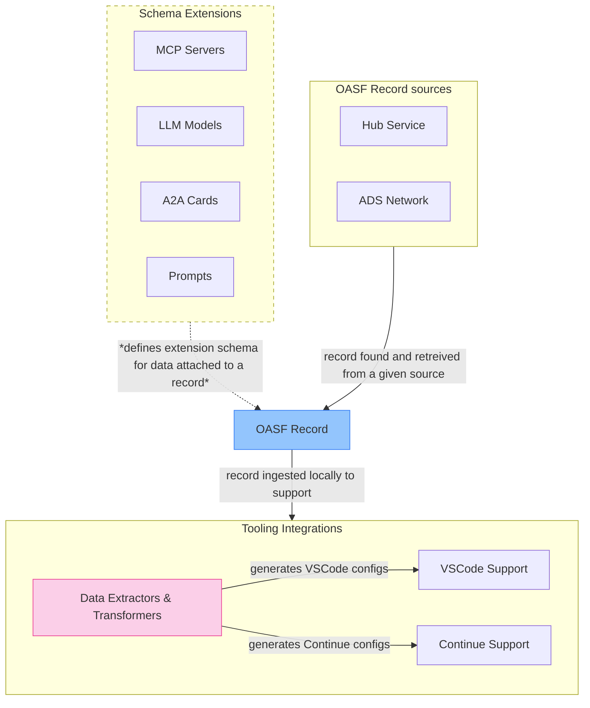

<div class="pt-6">
  
</div>

<br>

# AGNTCY Integration Capabilities: An Overview

<div class="pt-8">
  <span class="px-2 py-1 rounded cursor-pointer" hover="bg-white bg-opacity-10">
    by Ramiz Polic, Luca Muscariello
  </span>
</div>

<div class="abs-br m-6 flex gap-2">
  <a href="https://github.com/agntcy/dir" target="_blank" alt="GitHub"
    class="text-xl slidev-icon-btn opacity-50 !border-none !hover:text-white">
    <carbon-logo-github />
  </a>
</div>

---
layout: statement
---

# Goals

<br>

### **Support Agentic Standards**

Support widely-adopted standards for agentic development like MCP servers

<br>

### **Enhance Developer Experience**

Support AI-assisted developer workflows via tools and IDEs like Visual Studio Code

<br>

### **Simplified Integration**

Easy integration and usage of AGNTCY components like OASF and ADS

---
layout: default
---

# Methodology 

1. **Schema Extensions**
   - Use OASF records as data carriers for common tools
   - Add native support for **LLMs, Prompts, A2A Cards, MCP servers**

2. **Data Extractors and Transformers**
   - Generate tool-specific configuration files from OASF records
   - Support tool usage via **VS Code Copilot** and **Continue.Dev**

3. **Workflow Integration**
   - Provide simple setup instructions
   - Enable immediate productivity

---
layout: center
---

# Architecture 

<div class="">



</div>

---
background: "#eff3fc"
layout: center
---

# OASF Schema Extensions

---
layout: two-cols-header
---

# OASF Schema: LLM Extension

::left::

<div class="pr-2">

```json
{
  "extensions": [{
    "name": "schema.oasf.agntcy.org/features/runtime/model",
    "version": "v1.0.0",
    "data": {
      "models": [
        {
          "model": "deepseek-r1:1.5b",
          "provider": "ollama",
          "api_base": "http://localhost:11434",
          "prompt": "You are an expert software developer..."
        },
        {
          "model": "gpt-4o",
          "provider": "azure",
          "api_base": "${input:AZURE_OPENAI_API_BASE}",
          "api_key": "${input:AZURE_OPENAI_API_KEY}",
        }
      ]
    }
  }]
}
```

</div>

::right::

<div class="pl-6 pt-4">

## Features

Describes LLM support and its configuration for a given agent.

<br>

  - Multi-model support
  - Local and cloud providers
  - Model tuning parameters
  - Compatible with existing tools

</div>

---
layout: two-cols-header
---

# OASF Schema: LLM Prompt Extensions

::left::

<div class="pr-2">

```json
{
  "extensions": [{
    "name": "schema.oasf.agntcy.org/features/runtime/prompt",
    "version": "v1.0.0",
    "data": {
      "prompts": [
        {
          "name": "PR Summary",
          "description": "PR analysis",
          "prompt": "Summarize the pull request in detail..."
        },
        {
          "name": "PR Review",
          "description": "PR review",
          "prompt": "Review the pull request in detail..."
        }
      ]
    }
  }]
}
```

</div>

::right::

<div class="pl-6 pt-4">

## Features

Describes common LLM interaction prompts to use the agent.

<br>

  - Structured LLM Prompts
  - Categorized by purpose
  - Descriptive metadata
  - Task-specific instructions
  - Compatible with existing tools

</div>

<br><br><br><br><br>

---
layout: two-cols-header
---

# OASF Schema: MCP Server Extension

::left::

<div class="pr-2">

```json
{
  "extensions": [{
    "name": "schema.oasf.agntcy.org/features/runtime/mcp",
    "version": "v1.0.0",
    "data": {
      "servers": {
        "github": {
          "command": "docker",
          "args": [
            "run", "-i", "--rm", 
            "-e", "GITHUB_PAT",
            "ghcr.io/github/github-mcp-server"
          ],
          "env": {
            "GITHUB_PAT": "${input:GITHUB_PAT}"
          }
        }
      }
    }
  }]
}
```

</div>

::right::

<div class="pl-6 pt-4">

## Features

Describes MCP servers required to run and interact with the agent.

<br>

  - Support for multiple servers
  - Input variable mapping and templating
  - Compatible with existing tools

</div>

---
layout: two-cols-header
---

# OASF Schema: A2A Extensions

::left::

<div class="pr-2">

```json
{
  "extensions": [{
    "name": "schema.oasf.agntcy.org/features/runtime/a2a",
    "version": "v1.0.0",
    "data": {
      "name": "example-agent",
      "description": "An agent that performs web searches",
      "url": "http://localhost:8000",
      "capabilities": {
        "streaming": true,
        "pushNotifications": false
      },
      "defaultInputModes": ["text"],
      "defaultOutputModes": ["text"],
      "skills": [
        { "id": "browser", "name": "browser automation" }
      ]
    }
  }]
}
```

</div>

::right::

<div class="pl-6 pt-4">

## Features

Describes A2A card details for communication and its usage with A2A protocol.

<br>

  - Common A2A Card schema
  - Compatible with existing tools

</div>

---
background: "#eff3fc"
layout: center
---

# Agentic Workflow: IDE Integrations

---
layout: default
---

## Agentic Workflow: Example OASF record

<div class="max-h-md overflow-auto">

<<< @/integrations/record.json

</div>

---
layout: two-cols-header
---

# VS Code Integration

Explores ways to use OASF records to enable its usage in agentic workflows with VS Code.

::left::

## Implementation

1. Load and Process OASF records

2. Extract data from OASF record about:
     - MCP servers
     - NOTE: other components are not yet supported

3. Generate `.vscode/mcp.json` configuration file

::right::

<div class="pl-6 pt-4">

## Features

- **MCP Server Configuration**
  - Automatic server setup
  - Secure credential handling
  - Input variable templating

- **Copilot Agent Mode Support**
  - Native integration
  - Interactive credential prompts

</div>

<br>
<br>

---
background: "#eff3fc"
layout: center
---

# VS Code Integration: Live Demo

---
layout: two-cols-header
---

# Continue Integration

Explores ways to use OASF records to enable its usage in agentic workflows with VS Code Continue.dev extension.

::left::

## Implementation

1. Load and Process OASF records

2. Extract data from OASF record about:
     - MCP servers
     - LLM Data
     - Prompts
     - A2A information

3. Generate `.continue/assistants/` <br>configuration file

::right::

## Features

- **Quick Provisioning**
  - Multi-model configuration
  - Pre-defined prompts
  - MCP server integration

- **Dev Experience**
  - Assistant gallery integration
  - Model provider selection
  - Prompt usage

---
background: "#eff3fc"
layout: center
---

# Continue Integration: Live Demo

---
layout: two-cols-header
---

# MCP to OASF Example: Agentic App

Demonstrate the usage of OASF agents by loading them into IDEs and performing an agentic workflow to scan MCP server records from GitHub and create matching OASF records.

::left::

## VSCode Workflow

<br>

1. Open VSCode chat console
2. Switch to LLM (e.g., Claude)
3. Enable Agent mode
4. Enter conversion generation prompt
5. Check results

::right::

## Continue Workflow

<br>

1. Open Continue chat console
2. Refresh Assistants tab
3. Select OASF-generated assistant
4. Switch to configured LLM (Azure GPT-4o)
5. Select conversion generation prompt
6. Check results

<br>
<br>
<br>

---
layout: default
---

# MCP to OASF Example: OASF Record

Connecting everything together to showcase an example application.<br>
Built on top of OASF and ADS with native IDE support.

<div class="max-h-md overflow-auto">

<<< @/mcp-extractor-agent/extractor.record.json

<br>
<br>
</div>

---
background: "#eff3fc"
layout: center
---

# MCP to OASF Example: Live Demo

---
layout: statement
---

# Outcomes

<br>

**Extensible Schema**: OASF can easily support third-party integrations via extensions

**Minimal Impact**: No significant changes needed to ADS or OASF projects

**Simple Integration**: Straightforward integration of AGNTCY components

**Developer Experience**: Leverages familiar tools with minimal configuration

**Transformation Pattern**: Data extraction and transformation approach works well

---
layout: end
---

# Thank You

<div class="text-xl">
  <carbon-logo-github class="inline-block" /> <a href="https://github.com/agntcy/dir" target="_blank" class="border-none">github.com/agntcy/dir</a>
</div>
