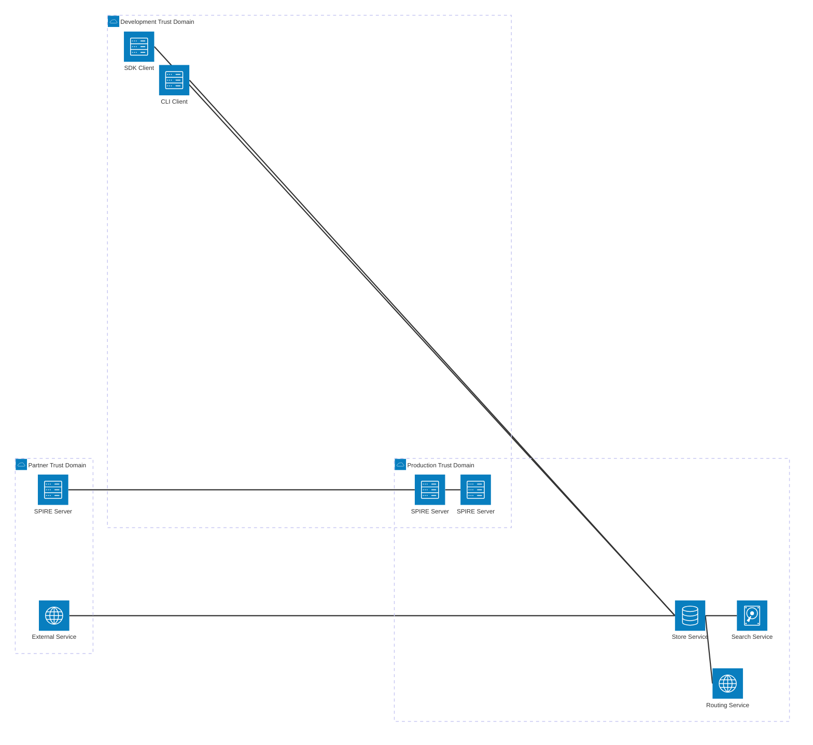

# [RFC] SPIFFE Protocol Integration for Directory Security Schema

*Note: this RFC template follows HashiCrop RFC format described [here](https://works.hashicorp.com/articles/rfc-template)*

|               |                                             |
| ------------- | ------------------------------------------- |
| **Created**   | 2025-08-12                                  |
| **Status**    | **WIP** \| InReview \| Approved \| Obsolete |
| **Owner**     | Ramiz Polic (@ramizpolic)                   |
| **Approvers** | AGNTCY Core WG                              |

---

This RFC proposes the integration of SPIFFE (Secure Production Identity Framework for Everyone) protocol for establishing a comprehensive security framework in the Directory project. SPIFFE provides a standardized approach to workload identity management in distributed systems through cryptographic identities and automatic credential lifecycle management. This enables production-ready zero-trust architecture with support for both X.509 and JWT-based authentication methods, enabling secure federation across trust domains and comprehensive authorization for all client interactions.

## Background

The Directory project currently operates in an insecure mode, lacking any authentication or authorization mechanisms. This architectural gap presents significant security risks as the project transitions toward production deployment and broader adoption. Namely, the system's current state presents several critical vulnerabilities:

1. **Open Access Architecture**: All Directory services accept connections without identity verification, creating unrestricted access to system resources
2. **Unencrypted Communication**: Inter-service and client-service communication occurs over plain gRPC without transport security
3. **Absence of Access Controls**: No authorization policies exist to govern resource access or operation permissions
4. **Compliance and Audit Gaps**: Lack of identity tracking prevents audit trail generation and regulatory compliance

### Production Security Requirements

Enterprise deployment demands a comprehensive security framework addressing:

- **Identity Management**: Cryptographic identity for all workloads and users with automatic credential lifecycle management
- **Authentication Framework**: Support for both programmatic access (X.509 certificates) and human interaction (JWT tokens) with seamless integration
- **Authorization System**: Fine-grained access control based on cryptographic identity verification and policy enforcement
- **Federation Capabilities**: Cross-domain authentication enabling multi-tenant deployments, partner integrations, and environment isolation
- **Operational Security**: Automatic credential rotation, comprehensive audit logging, and zero-trust architecture principles

## Proposal

This RFC proposes implementing SPIFFE as the foundational security framework for the Directory project, establishing comprehensive authentication and authorization capabilities while enabling secure federation across organizational and environmental boundaries.

### SPIFFE Protocol Advantages

SPIFFE addresses the Directory project's security requirements through several key capabilities, with particular strength in distributed system environments:

- **Standardized Workload Identity**: Provides cryptographically verifiable identity for every workload without manual certificate management, ensuring consistent authentication across distributed service instances
- **Automatic Credential Lifecycle**: Eliminates operational overhead through automated certificate issuance, renewal, and revocation, critical for managing authentication at scale in distributed architectures
- **Distributed Trust Architecture**: Agent-based design provides local authentication caching and validation, ensuring continued operation during network partitions common in distributed systems
- **Federation Architecture**: Enables secure cross-domain communication through standardized trust establishment mechanisms, supporting multi-region and partner organization integration
- **Network Partition Tolerance**: Services maintain authentication capabilities through local SPIRE agents even when connectivity to central authority is lost, essential for distributed system resilience
- **Geographic Distribution Support**: Hierarchical SPIRE server deployment optimizes authentication latency across multiple data centers and cloud regions
- **Zero-Trust Foundation**: Establishes cryptographic verification for every transaction, supporting modern security architecture principles in complex distributed topologies
- **Ecosystem Integration**: Seamless compatibility with Kubernetes, service mesh technologies, and cloud-native infrastructure across distributed environments

### Implementation Strategy

The security framework will provide universal authentication coverage across all Directory components, eliminating the current insecure communication patterns while addressing the unique challenges of distributed system architectures.

- **Distributed Authentication**: SPIRE agents deployed alongside each service instance provide local certificate caching and validation, ensuring authentication operations continue during network partitions and reducing latency in geographically distributed deployments.
- **Unified Authentication Layer**: Implement support for both X.509-SVID and JWT-SVID authentication methods, enabling optimal security approaches for different interaction patterns.
- **Policy-Based Authorization**: Deploy fine-grained authorization controls based on cryptographic identity verification and configurable access policies.
- **Hierarchical Trust Management**: Regional SPIRE servers establish trust hierarchies that optimize for network topology while maintaining centralized policy control, enabling efficient authentication across multiple data centers and cloud regions.
- **Resilient Operation**: The agent-based architecture ensures that services maintain authentication capabilities even when connectivity to central authority is temporarily lost, critical for the Directory project's distributed service mesh.
- **Federation Framework**: Enable secure cross-domain authentication supporting multi-tenant deployments, partner integrations, and environment isolation.

Authorization policies will be enforced based on cryptographic identity verification, supporting both service-to-service and user-initiated operations. The federation capability will enable secure communication across different trust domains, supporting complex deployment scenarios including multi-cloud and partner organization integration.

---

## Implementation

### Architecture Overview

The SPIFFE integration establishes a comprehensive security framework supporting federation across multiple trust domains while providing unified authentication for all client types.

### Technical Integration

- **Server Enhancement**: Directory services will integrate the SPIFFE Workload API to automatically obtain and manage cryptographic identities. Authentication interceptors will validate both X.509 certificates and JWT tokens, extracting SPIFFE IDs for authorization decisions.
- **Client Integration**: All clients will be configured to obtain appropriate SPIFFE credentials through the local SPIRE agent. The authentication method (X.509 or JWT) will be determined by operational requirements rather than client type restrictions.
- **Policy Framework**: Authorization decisions will be based on SPIFFE ID verification and configurable access policies, supporting both local and federated trust relationships.

### Federation Architecture

The multi-domain architecture enables secure communication across organizational boundaries through SPIRE server federation. Trust relationships are established through cryptographic verification, allowing controlled access between different environments and partner organizations while maintaining security isolation.

## UX

## User Experience

### Operational Simplicity

The SPIFFE integration maintains operational simplicity while introducing enterprise-grade security. All authentication mechanisms operate transparently through local SPIRE agent connections, requiring minimal configuration changes to existing workflows.

Users and applications receive automatic identity provisioning without manual certificate management. The authentication process becomes seamless through standardized SPIFFE protocols, ensuring security without operational complexity.

### Infrastructure Requirements

- **SPIRE Server Deployment**: Central identity authority managing certificate issuance and trust relationships. Deployed with high availability configuration and persistent storage for production environments.
- **SPIRE Agent Distribution**: Lightweight agents deployed alongside Directory services and client applications, providing seamless identity management without application code changes.
- **Trust Domain Configuration**: Establishes the security boundary and identity namespace for the Directory ecosystem, with support for federation with external partners and environments.

### Operational Integration

- **Service Enhancement**: Directory services integrate with the local SPIRE agent through standard Unix socket connections, requiring minimal configuration changes to existing deployment manifests.
- **Client Configuration**: All client types receive automatic identity provisioning through environment-specific SPIRE agent connections, eliminating manual certificate management.
- **Federation Enablement**: Cross-environment access is established through SPIRE server federation, allowing secure communication between development, staging, and production environments without compromising security isolation.

---

## Alternative Solutions

### 1. Service Mesh (Istio/Linkerd) with mTLS

**Pros:**
- Automatic mTLS between services
- Rich traffic management features
- Mature ecosystem and tooling

**Cons:**
- Significant operational overhead
- Requires complete service mesh deployment
- Less granular identity control
- Vendor lock-in considerations

**Decision:** SPIFFE provides identity without requiring full service mesh adoption, allowing incremental deployment.

### 2. HashiCorp Vault with PKI

**Pros:**
- Comprehensive secret management
- Established enterprise adoption
- Rich policy engine

**Cons:**
- More complex than needed for identity only
- Requires Vault infrastructure management
- Less standardized workload identity
- Additional licensing considerations

**Decision:** SPIFFE is purpose-built for workload identity and offers better standardization.

### 3. Custom JWT-based System

**Pros:**
- Simpler implementation
- No external dependencies
- HTTP-native

**Cons:**
- Lack of automatic rotation
- No cryptographic verification
- Custom security implementation risks
- Limited ecosystem integration

**Decision:** SPIFFE provides proven, standardized security with automatic rotation.

### 4. Cloud Provider IAM (AWS IAM, GCP IAM, Azure AD)

**Pros:**
- Native cloud integration
- Comprehensive permission systems
- Managed service (no infrastructure)

**Cons:**
- Cloud vendor lock-in
- Limited cross-cloud functionality
- Less granular workload identity
- Complex configuration for service-to-service auth

**Decision:** SPIFFE provides cloud-agnostic solution with better workload-focused identity.

### 5. Decentralized Identity Systems (DID/Verifiable Credentials)

**Pros:**
- Self-sovereign identity principles
- No central authority dependency
- Cryptographic verifiability
- Standards-based (W3C DID specification)

**Cons:**
- Immature ecosystem for service authentication
- Complex key management and recovery
- Limited enterprise tooling and support
- Performance concerns for high-frequency operations
- Blockchain dependency in many implementations

**Decision:** While promising for user identity, decentralized systems lack maturity for service-to-service authentication in enterprise environments.

### 6. Distributed Certificate Authorities (Gossip-based PKI)

**Pros:**
- No single point of failure
- Distributed trust establishment
- Resilient to network partitions
- Self-healing infrastructure

**Cons:**
- Complex consensus mechanisms
- Difficult operational troubleshooting
- Potential for certificate conflicts
- Limited standardization and tooling
- Network overhead from gossip protocols

**Decision:** SPIFFE provides proven distributed trust through federation without requiring complex consensus protocols.

### Decentralized and Distributed Systems Considerations

The Directory project's distributed architecture presents unique challenges that influence authentication system selection:

**Network Partitions**: Directory services must continue operating during network splits. SPIFFE's cached certificates and local validation enable continued operation, while decentralized consensus systems may become unavailable during partitions.

**Geographic Distribution**: Services deployed across multiple regions require efficient identity verification. SPIFFE's hierarchical trust model with regional SPIRE servers provides low-latency authentication, whereas blockchain-based systems may introduce unacceptable latency.

**Scalability Requirements**: The Directory project anticipates significant growth in service instances and client connections. SPIFFE's agent-based architecture scales horizontally, while centralized systems create bottlenecks and fully decentralized systems may face performance degradation.

**Operational Complexity**: Distributed systems require sophisticated monitoring and debugging capabilities. SPIFFE provides centralized logging and metrics through SPIRE servers, while maintaining distributed operation through agents.

**Trust Establishment**: In distributed environments, trust bootstrapping becomes critical. SPIFFE's attestation mechanisms provide secure, automated identity verification, while decentralized systems often require complex out-of-band trust establishment.

### Comparison Matrix

| Solution | Implementation Complexity | Operational Overhead | Security Strength | Vendor Lock-in | Standards Compliance | Distributed System Fit | Network Partition Tolerance |
|----------|-------------------------|---------------------|------------------|----------------|---------------------|------------------------|----------------------------|
| SPIFFE/SPIRE | Medium | Medium | High | None | High (CNCF) | Excellent | High |
| Service Mesh | High | High | High | Medium | Medium | Good | Medium |
| HashiCorp Vault | High | High | High | Medium | Low | Good | Low |
| Custom JWT | Low | Low | Medium | None | None | Poor | Medium |
| Cloud IAM | Medium | Low | Medium | High | Low | Poor | Low |
| Decentralized Identity | High | High | High | None | High (W3C) | Fair | High |
| Distributed CA | Very High | Very High | High | None | Low | Good | Very High |

### Summary

1. **Standardization**: CNCF project with industry-wide adoption and proven distributed system patterns
2. **Flexibility**: Works across clouds, on-premises, and hybrid environments with geographic distribution support
3. **Automatic Rotation**: Built-in certificate and token lifecycle management without consensus overhead
4. **Zero-Trust Ready**: Cryptographic identity verification for every workload in distributed architectures
5. **Federation**: Native support for cross-domain authentication enabling multi-region and partner integration
6. **Ecosystem Integration**: Works with Kubernetes, service meshes, and CI/CD systems across distributed environments
7. **Distributed System Optimization**: Agent-based architecture provides network partition tolerance and local caching
8. **Operational Simplicity**: Centralized management with distributed operation, avoiding complex consensus mechanisms
